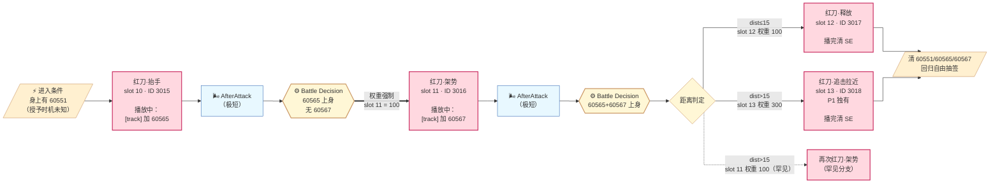

# Combo Chains 教学

**这份文档不描述完整状态机，只讲两条最典型的 Combo Chain：红刀链和吸球链。**

它们展示了 FS AI 的一个核心机制：**依赖动画的状态机**——状态转移不写在 lua 里，而是编码在动画 track 的 SE 授予时机中。

---

## 什么是 Combo Chain

普通 Interrupt 派生和 Combo Chain 的对比：

| | Interrupt 派生 | Combo Chain |
|---|----------------|-------------|
| 机制 | 招式播放中关键帧触发 → 立即 append 派生 | 招式播完 + AfterAttack + 下次 Battle Decision + SE 强制走特定 slot |
| SubGoal 队列 | 同一队列内 append | 跨多次 Activate 循环 |
| 状态 | 无状态 | 由 SE 60551/60565/60567 等驱动 |
| 典型例子 | 近战A 5025帧接 3008 | 红刀·抬手 → 架势 → 释放 |
| 玩家感受 | "boss 打了两下没停" | "boss 在做一段仪式，中间有间隔但必然打完" |

**关键区别**：Interrupt 派生的多段 combo 之间没有 AfterAttack。Combo Chain 的每段之间有 AfterAttack（虽然很短）。

---

## 红刀链（4 段版，P1-B 独有）

**核心机制**：
- **每段之间必然经过 AfterAttack + Battle Decision**——这是"呼吸"，虽然短
- **Battle Decision 检查 SE，权重强制走对应 slot**——不是随机抽
- **slot 13 的追击是 P1 独有**——DragonForm boss 不需要它（速度更快）

---

## 吸球链（4 段版，P1-B / P2 共用）

```mermaid
%%{init: {'flowchart': {'curve': 'stepBefore'}}}%%
flowchart LR
    ENTRY[/"⚡ 进入条件<br>权重池抽到 slot 15<br>需 dist>10 才有权重"/]
    B15["吸球·启动<br>slot 15 · ID 3025<br><br>播放中：<br>[track] 加 60566"]
    AA1["🌬 AfterAttack"]
    HUB1{{"⚙ Battle Decision<br>60566 上身"}}
    BRANCH{"距离判定"}
    B16["吸球·释放1次<br>slot 16 · ID 3026<br>（P2 可 swap 3028/3030）"]
    B17["吸球·释放2次<br>slot 17 · ID 3027<br>（P2 可 swap 3029/3031）"]
    AA2["🌬 AfterAttack"]
    HUB2{{"⚙ Battle Decision<br>60553 可能上身"}}
    B18["🔵 超大球（大招）<br>slot 18 · ID 3032"]
    EXIT[/"回归自由抽签"/]

    ENTRY --> B15
    B15 --> AA1 --> HUB1
    HUB1 --> BRANCH
    BRANCH ==>|"dist>12.5"| B16
    BRANCH ==>|"dist≤12.5"| B17
    B16 --> AA2
    B17 -.->|"可能加 60553"| AA2
    AA2 --> HUB2
    HUB2 ==>|"若 60553"| B18
    HUB2 -.->|"若无 60553"| EXIT
    B18 --> EXIT

    classDef entry fill:#fff0d0,stroke:#cc9966
    classDef ball fill:#d8e0ff,stroke:#3366cc,stroke-width:2px
    classDef bigball fill:#c8d0ff,stroke:#3366cc,stroke-width:3px
    classDef aa fill:#e8f8ff,stroke:#4477bb
    classDef hub fill:#fff7d6,stroke:#cc9966,stroke-width:2px
    classDef branch fill:#fff7d6,stroke:#cc9966
    classDef exit fill:#e8f8ff,stroke:#4477bb,stroke-width:2px

    class ENTRY,EXIT entry
    class B15,B16,B17 ball
    class B18 bigball
    class AA1,AA2 aa
    class HUB1,HUB2 hub
    class BRANCH branch
```

---

## 教学要点

### 1. SE 是"跨 Activate 的状态变量"

lua 局部变量每次 Activate 清零，无法保存"我打到哪一段了"。

**解决方案**：让动画 track 在关键帧把"进度"写到 boss 身上（SE 60565），下次 Activate 读回来。

**本质**：把 memory 存在 game world 里，让引擎的 SE 系统当 storage backend。

### 2. 每段 combo 之间都有 AfterAttack

看似连贯的红刀 combo，实际是 3-4 次独立的 Activate 循环。每次都有 AfterAttack 空 Goal 插入，只是它很短（因为下次 Activate 立刻抽到强制 slot），所以玩家感觉是"连贯 combo"。

**这个"极短呼吸"就是 combo 的心跳**。

### 3. 状态机的边由动画师定义

"打完红刀·抬手后必接架势"这句话在 lua 里没有直接写。它是这样成立的：

- Act10 动画的第 N 帧 track 加 60565
- Activate 检测到 60565 → 权重强制 slot 11

**如果动画师没有在 track 里加 SE，代码依然运行，但 combo 链会断掉**。状态转移的所有权在动画数据里，不在 lua 代码里。

### 4. 分支存在于两处

| 分支类型 | 出现位置 | 性质 |
|---------|---------|------|
| 权重池抽签 | Battle Decision 内 | 概率分支（吸球启动: dist>10 时才可能被抽到）|
| SE 检测 | Battle Decision 顶层 | 确定性分支（60566 后按 dist 强制走 16 或 17）|

两者叠加 = **有节制的不确定性**。

### 5. 双重身份招：Slot 18（超大球）

- **首次释放**：P1-A → P1-B 的转阶段仪式
- **之后释放**：P1-B/P2 的常规大招（由 60553 SE 触发）
- **P2-B 特殊**：HP<0.2 强制 slot 18 = 100 作为处决招

FS 用同一个 slot 承载多个语义 → 减少数据量 + 保持视觉一致（玩家看到的都是"超大球"这一招）。
