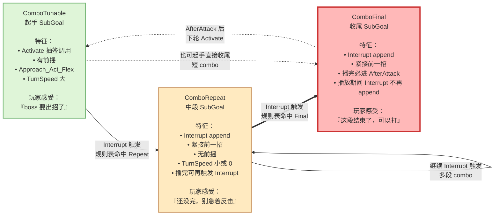
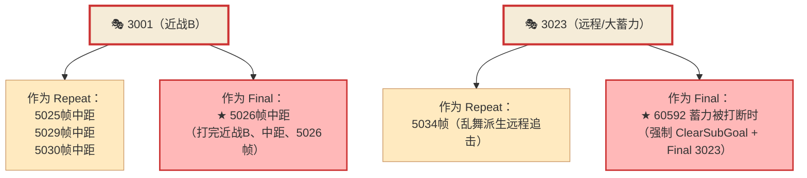
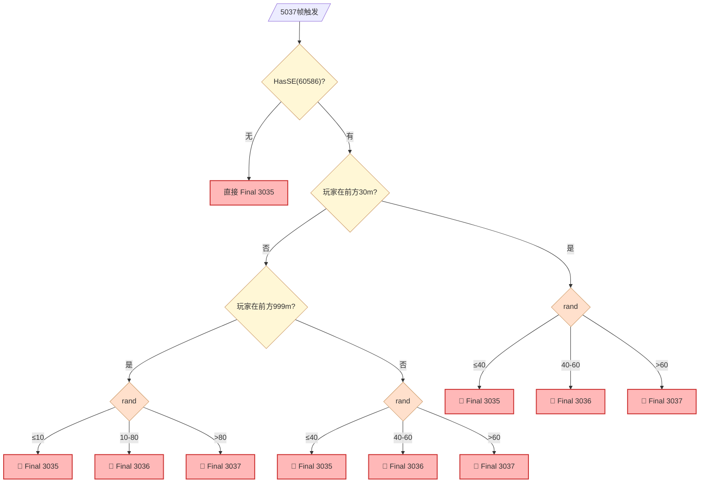

# Combo 终止规则 · 玩家学习锚点

**核心洞察**：FS 通过"结束招式的类型"控制 combo 深度，玩家在多次挑战中下意识识别 Final 招 = 学会 boss 的"战斗语法"。

---

## SubGoal 三分类（隐藏语法）

---

## Final 招分类（战斗语法的"句号"）

**只有 4 组共 8 个 AttackID 是 Final**——这就是玩家需要学会识别的东西。

### 组 1：飞扑终结

| AttackID | 语义 | 出现在 |
|----------|------|--------|
| **3039** | 飞扑终结 | 5035帧（60555+rand≤70）/ 5036帧（60545+60555 或 !60545）/ 5038帧 |

玩家识别：**高幅度撞击音 + 落地反弹**

### 组 2：长吼叫收尾（3 变体）

| AttackID | 语义 | 出现在 |
|----------|------|--------|
| **3035** | 长吼叫收尾·1 | 5037帧 rand≤40 |
| **3036** | 长吼叫收尾·2 | 5037帧 rand 40-60 |
| **3037** | 长吼叫收尾·3 | 5037帧 rand>60 |

玩家识别：**长吼叫的必然接续**——3 种不同视觉但都是"结束"

### 组 3：蓄力打断收尾（唯一）

| AttackID | 语义 | 出现在 |
|----------|------|--------|
| **3023** | 远程/大蓄力（作为 Final 时）| 60592 蓄力被打断 → ClearSubGoal + Final 3023 |

玩家识别：**boss 蓄力被玩家打到时的强制收招**

### 组 4：普攻收尾（唯一）

| AttackID | 语义 | 出现在 |
|----------|------|--------|
| **3001** | 近战B（作为 Final 时）| 5026帧中距（打完近战B、中距玩家、5026帧）|

玩家识别：**boss 打完近战B 后中距玩家看到又一次近战B**——这次是句号

---

## 两栖招（Repeat 或 Final 视情境）

**玩家学习难点**：同一动画有时接下段有时结束——**无法 100% 预判 = 「魂系博弈感」的来源**。

---

## 纯 Repeat 招（"见到它，说明还没完"）

| AttackID | 语义 |
|----------|------|
| **3002** | P2 重击追击 |
| **3008** | P1 重击追击 |
| **3006** | 横扫中距派生 |
| **3007** | 横扫近距派生 |
| **3011** | 180°回身斩（P2 独有）|
| **3014** | 二段重击 |
| **3019** | 乱舞派生（P2-B）|
| **3033** | 飞扑追击（可再接 3039 收尾）|

---

## 设计洞察

### 洞察 1：玩家学的不是招数，是"语法"

多次战斗后玩家能预判"这段结束了"，但他不是记招表，是识别 Final 的视觉/听觉特征：

- 3039 的震撼落地
- 3035/3036/3037 的三种大幅度收招
- 3001 中距的"看似普通但已收"

**FS 通过 SubGoal 类型 + 动画视觉双重编码，让玩家"学会读 boss 的句号"，无需教程。**

### 洞察 2：两栖招是"难度上限"

如果所有招都是纯 Repeat 或纯 Final，boss 完全可预测 → 老手无脑赢。

3001 和 3023 的两栖性：
- **3001 中距 5026帧**：25% 概率转 Final（rand≤70 走 Repeat, else 没接）→ 玩家永远不能确定"这次 3001 是不是真结束"
- **3023 蓄力打断**：主动打断 boss 时才触发 Final → 玩家自己的行为改变 boss 的响应

**保留了"再熟练也有意外"的空间。**

### 洞察 3：每种大招家族有专属 Final

- 飞扑家族 → 3039 收尾（专属）
- 长吼叫家族 → 3035/3036/3037 三选一收尾（专属）
- 蓄力家族 → 3023（被打断时）（专属）
- 普通近战家族 → 3001（中距特定条件）（半专属）

**Final 招和触发它的起手招在美术上视觉呼应，形成「起手→中段→专属收尾」的完整乐句。玩家在挑战失败中记住的正是这些「乐句结构」。**

### 洞察 4：长吼叫的 3-变体收尾

5037帧的 Interrupt 分支非常复杂：

**同一个"长吼叫大招"有 3 种收尾变体**，由距离 + 概率组合决定。

**玩家会觉得"长吼叫每次都不一样"，但其实只是从 3 种收尾里抽签**。这是"用少量素材制造大量差异感"的技巧——只需要 3 段动画，就能给玩家"每次战斗都有新体验"的感受。
