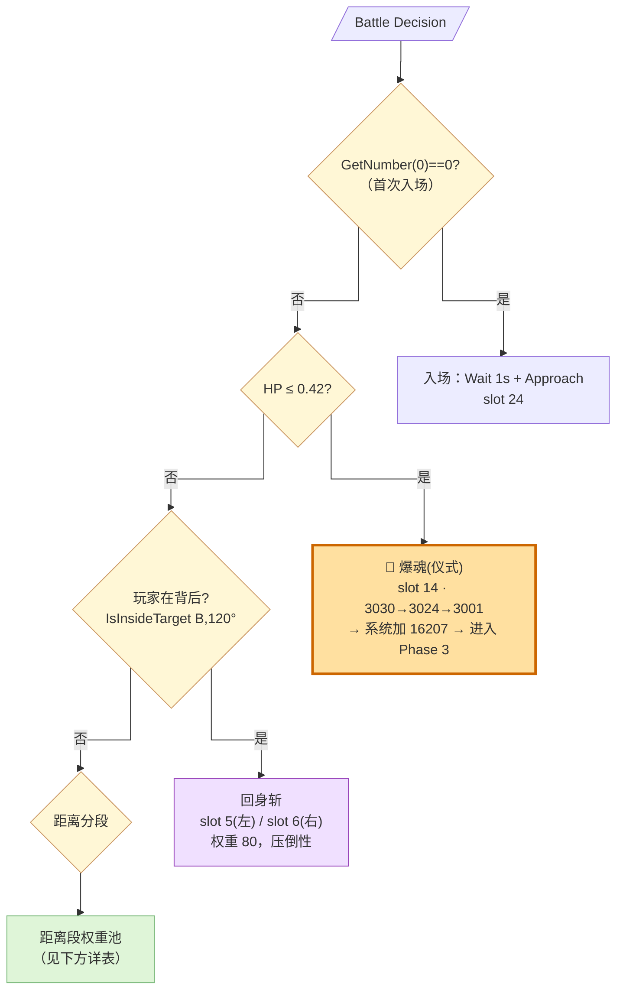
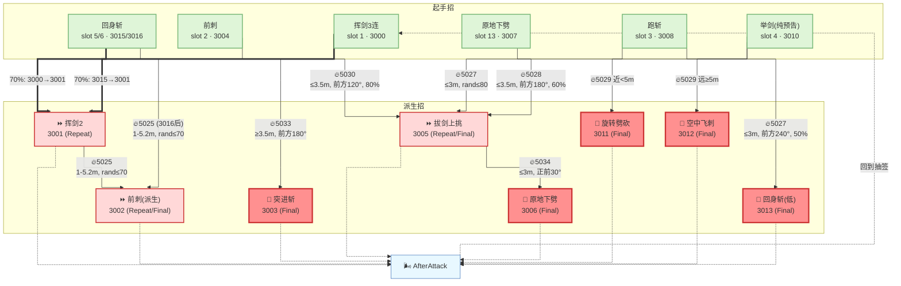

# Slave Knight Gael — Phase 2 全景图

**触发条件**：`HasSpecialEffectId(TARGET_SELF, 16207) == false`（非3阶段）

**源文件**：`620000_battle.lua`（c6200 模型，2/3阶段共用）

**注意**：盖尔 1 阶段使用 c6201 模型和另一个 lua 脚本，不在本文件范围。

---

## 阶段概述

Phase 2 的盖尔已经进入黑暗之魂化身形态，拥有大剑 + 连弩 + 白教法术三套工具。

**HP 分层**：

| 血量 | 行为 |
|------|------|
| HP > 0.42 | 正常权重池（按距离×朝向抽签）|
| **HP ≤ 0.42** | 强制 slot 14 → 3030 爆魂 → 系统加 SE 16207 → 进入 Phase 3 |

**转阶段机制**：和垃圾王不同，盖尔的阶段 SE (16207) 不是动画 track 加的，而是**系统 param 在 HP 到阈值时直接注入**。lua 层只能读到"有没有"。

---

## 分类标准

- **近战类**：大剑攻击，走权重抽签
- **远程类**：连弩/法术，同样走权重抽签（不像垃圾王有独立的"特殊类"）
- **走位类**：转身/侧步/后撤
- **仪式类**：HP≤0.42 强制的转阶段招

---

## 全景图 · 顶层判定优先级

---

## 一、近战类

### 招式清单

| Slot | 招式 | AttackID | CD | 特点 |
|------|------|----------|-----|------|
| 1 | 挥剑3连 | 3000→3001(→3002) | 9s | 30% 单击 / 70% 双击；最经典的攻击 |
| 2 | 前刺 | 3004 | 6s | ComboAttackTunableSpin（带旋转追踪） |
| 3 | 跑斩 | 3008 | 6s | 远距突进逼近并下劈 |
| 4 | 举剑(纯预告) | 3010 | 25s | ⚠ 无攻击判定！Interrupt 5029 决定后续 |
| 5 | 回身斩(左) | 3015(→3001) | 6s | 70% 接挥剑2；玩家在背后左侧 |
| 6 | 回身斩(右) | 3016 | 6s | 玩家在背后右侧 |
| 13 | 原地下劈 | 3007 | 6s | 近距专用，有后续 SE 5028 |

### SE 16206 的作用

当 boss 身上有 `16206` 时，所有近战起手的 `Approach_Act_Flex` 距离参数被清零——boss **不会接近玩家就直接出招**。推测是 combo 中途的"不要浪费时间调距"标记。

---

## 二、远程/法术类

| Slot | 招式 | AttackID | CD | 特点 |
|------|------|----------|-----|------|
| 11 | 连弩后撤 | 3022→3008 | 15s | 后退射箭，固定接跑斩（攻守转换） |
| 12 | 白教光环 | 3028 | 25s | 3重祷告，中距专用，Approach 30m |
| 16 | 连弩前进 | 3025→3026 | 20s | 掏弩+边走边射，远距专用 |

---

## 三、走位类

| Slot | 招式 | 特点 |
|------|------|------|
| 20 | 转身 | Turn 90°，玩家在背后时 |
| 21 | 侧步 | SidewayMove，随机左右 |
| 22 | 后撤 | LeaveTarget 1.5s |
| 25 | 跳攻(高差) | 3035，玩家在高处时（dist-distY≤2 且 distY≥4） |

---

## 四、权重矩阵

**无 16207、玩家在前方的距离段权重**：

| Slot | ≥14m | 5.3-14m | 2.3-5.3m | <2.3m |
|------|------|---------|----------|-------|
| 1 挥剑 | 1 | 1 | 1 | 25 |
| 2 前刺 | 0 | 10 | 30 | 0 |
| 3 跑斩 | 36 | 30 | 0 | 0 |
| 4 举剑 | 18 | 10 | 0 | 15 |
| 11 连弩后撤 | 0 | 0 | 0 | 20 |
| 12 白教光环 | 0 | 20 | 40 | 0 |
| 13 下劈 | 0 | 0 | 20 | 20 |
| 16 连弩前进 | 36 | 30(≤7m:0) | 0 | 0 |
| 21 侧步 | 0 | 0 | 10 | 0 |
| 22 后撤 | 0 | 0 | 0 | 20 |
| 25 跳攻 | 10 | 0 | 0 | 0 |

**距离设计意图**：
- **远距(≥14m)**：跑斩(36) + 连弩前进(36) + 举剑(18) — boss 用突进或射击逼近
- **中距(5.3-14m)**：跑斩(30) + 连弩前进(30) + 白教光环(20) — 均衡压制
- **近距(2.3-5.3m)**：白教光环(40) + 前刺(30) + 下劈(20) — 法术+近战混合
- **贴脸(<2.3m)**：挥剑(25) + 下劈(20) + 后撤(20) + 举剑(15) — 近战爆发但也会拉开

---

## 五、Interrupt 派生表（状态图）

---

## 六、设计洞察

1. **"举剑"是纯粹的 telegraph（预告）节点** — 3010 没有攻击判定，它存在的唯一目的是让玩家看到"举剑"后有时间判断距离。Interrupt 5029 根据那一帧玩家在哪，决定是旋转劈（近）还是飞刺（远）。这是"给玩家读招机会"的代码实现。

2. **连弩后撤(slot 11) = 攻守转换招** — 3022(后退射箭) 固定接 3008(跑斩)。这让 boss 先拉开距离再突进回来，一招之内完成"退→进"的节奏变化。

3. **30% 单击 / 70% 双击** — Act01 的概率门限让挥剑这一招有不可预测性。玩家翻滚一次后如果立刻反击，30% 时候安全，70% 时候吃第二刀。

4. **AfterAttack 是完全空壳** — 垃圾王的 AfterAttack 也是空的，但至少 `AddSubGoal(Goal, 10)` 有 10s 超时。盖尔的更极端：Activate 里读了 dist 和 rand 但什么都不做。意味着**呼吸窗口完全由动画后摇长度决定**，lua 不加任何额外等待。

5. **没有 SE 进度位驱动的 combo chain** — 和垃圾王的红刀链/吸球链完全不同。盖尔的 combo 全部靠"Act 内排队"或"Interrupt 一次性 Clear+Add"。这意味着盖尔的连段**一旦开始就不可打断**（没有跨 Activate 的间隙）。
