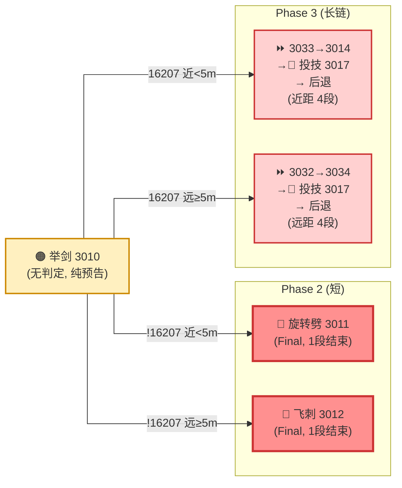
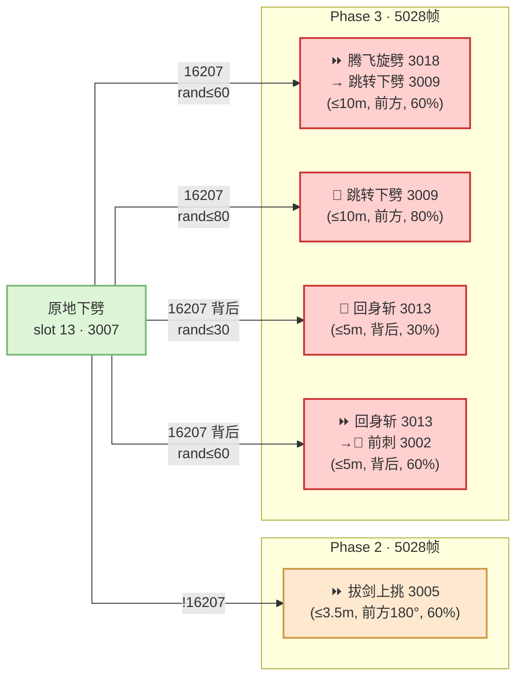

# Slave Knight Gael — Phase 3 全景图

**触发条件**：`HasSpecialEffectId(TARGET_SELF, 16207) == true`

**与 Phase 2 的关系**：同一个 lua 文件、同一个 Activate 函数、同一个 Interrupt 函数。Phase 3 不是"新状态机"，是"同一个状态机的权重/Interrupt 分支变化"。

---

## 和 Phase 2 的差异总览

| 维度 | Phase 2 | Phase 3 |
|------|---------|---------|
| 挥剑3连(slot 1) | 30% 单击 / 70% 双击 | **100% 双击** |
| 举剑 combo(5029) | 近→旋转劈(1段) / 远→飞刺(1段) | 近→**4段链含投技** / 远→**4段链** |
| 跑斩派生(5027) | 近→回身斩/拔剑 | **远→跳转下劈 3009** |
| 下劈派生(5028) | 近→拔剑上挑 | **+腾飞旋劈 3018→3009(2段)** **+回身斩→前刺(2段)** |
| 新增起手 slot 14 | 仅作仪式（HP≤0.42 强制）| **常规大招，CD 60s** |
| 新增起手 slot 15 | 不存在 | **飞斩接挥 3024→3001，CD 20s** |
| 背后反应 | slot 5/6 (w:80) + slot 20(转身,w:10) | slot 5/6 (w:90) + slot 20(w:10) + **slot 11=0** |
| 突进斩 5033 派生 | ✓ (≥3.5m 触发) | **✗ (16207 时跳过)** |

---

## 新增招式（Phase 3 独有）

### 新起手招

| Slot | 招式 | AttackID | CD | 距离/条件 |
|------|------|----------|-----|-----------|
| 14 | 爆魂+飞斩 | 3030→3024 | 60s | 近距(2.3-5.3m)，w:20 |
| 15 | 飞斩接挥 | 3024→3001 | 20s | 远距(≥5.3m)，w:27 |

### 新派生招（Interrupt 内）

| AttackID | 招式 | 出现在 | 类型 |
|----------|------|--------|------|
| 3009 | 跳转下劈 | 5027远距 / 5028中距 | Final |
| 3013→3002 | 回身斩→前刺(2段链) | 5027近距 / 5028背后 | Repeat→Final |
| 3018 | 腾飞旋劈 | 5028中距(≤10m) | Repeat (接3009) |
| 3014 | 飞旋劈砍 | 5029近距 | Repeat (举剑combo内) |
| 3017 | 投技(后退腾空刺) | 5029近/远 | 举剑combo终段 |
| 3033→3014→3017 | 举剑近距4段链 | 5029近 | 全链 |
| 3032→3034→3017 | 举剑远距4段链 | 5029远 | 全链(3032/3034可能废案) |

---

## 权重矩阵变化

**有 16207、玩家在前方**：

| Slot | ≥5.3m | 2.3-5.3m | <2.3m |
|------|-------|----------|-------|
| 1 挥剑 | 1 | 5 | 5 |
| 2 前刺 | 0 | 25 | 0 |
| 3 跑斩 | 36 | 0 | 0 |
| 4 举剑 | 36 | 20 | 30 |
| 13 下劈 | 0 | 20 | 45 |
| **14 爆魂** | 0 | **20** | **20** |
| **15 飞斩** | **27** | 0 | 0 |
| 25 跳攻 | 10(>10m) | 0 | 0 |

**关键变化**：
- **举剑(slot 4) 权重大幅提升**：远距 36（Phase 2 是 18）、贴脸 30（Phase 2 是 15）— boss 更频繁进入"举剑→4段链"这个最危险的模式
- **slot 11/12/16 (连弩/法术) 全部消失** — 3阶段盖尔不再用远程压制，完全近战化
- **slot 13 (下劈) 贴脸权重 45** — 成为贴脸最高权重招，因为 5028 Interrupt 在 Phase 3 能接出最长 combo

---

## 举剑 Combo：Phase 3 的核心威胁

Phase 2 的举剑是"1段 Final 收尾"。Phase 3 变成"4段链条"——这是 3阶段盖尔最让玩家恐惧的设计：

**设计意图**：
- "举剑"这个预告动画在 Phase 2 和 Phase 3 是**同一个动画 (3010)**
- 玩家在 Phase 2 学会了"看到举剑 → 一段攻击 → 安全反击"
- Phase 3 打破这个预期：**同样的举剑起手，后面接的是 4 段**
- 投技 (3017) 作为终段 = 逼迫玩家在链条最后做"闪避 vs 不动"的判断

---

## 下劈 Combo：Phase 3 的攻击密度升级

Phase 3 的下劈从"1次派生"变成"4种可能的 2 段 combo" — **同一个起手动画，后续概率分支翻了 4 倍**。

---

## 设计洞察

1. **Phase 3 不是"新 boss"，是"同一个 boss 去掉安全策略"**
   - 移除了所有远程/法术 (slot 11/12/16)
   - 挥剑从 30% 单击变 100% 双击
   - 举剑从 1 段 Final 变 4 段链
   - → 玩家在 Phase 2 学到的"安全距离"在 Phase 3 不再安全

2. **投技 (3017) 是"终极读招测试"**
   - 出现在举剑 4 段链的最末段
   - 前面 3 段都是普通闪避就能躲的挥砍，第 4 段突然变成投技（需要不同的回避方式）
   - 玩家必须数到第 4 段才知道要改变策略

3. **3阶段的"爆魂"从仪式退化为常规大招**
   - 和垃圾王的 Act18/Act38 完全一样的套路
   - 首次释放 = 转阶段仪式（不可避免）
   - 之后 = CD 60s 的常规大招（可预判、可应对）
   - 玩家第一次被强制看到"这招长什么样"，之后每次都有准备

4. **"同一个动画，不同的后续" = FS 的核心复用手法**
   - 举剑 (3010) 在 Phase 2 和 3 动画相同，后续天差地别
   - 下劈 (3007) 在 Phase 2 和 3 动画相同，派生数量翻倍
   - 这让美术资产成本最小化，同时让玩家的"读招经验"在阶段切换时被颠覆
