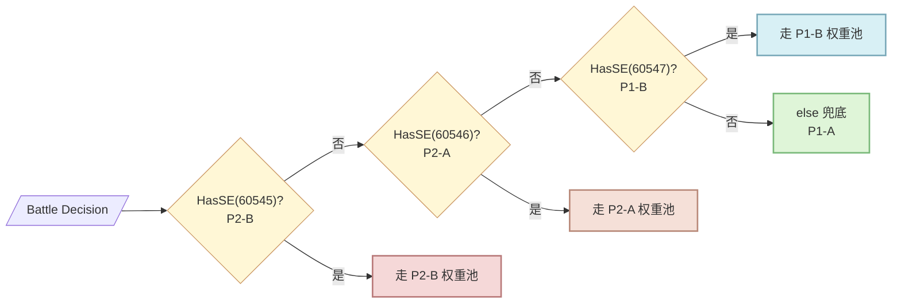

# Boss 顶层状态机 · 全景图（v4）

**4 大子状态 + 3 个转移仪式**

---

## 顶层状态转移图

```mermaid
%%{init: {'flowchart': {'curve': 'stepBefore'}}}%%
flowchart TB
    START(["⚡ Boss 唤醒<br>ESD 起立完成"])
    P1A["Phase 1-A<br>SE: 无（else 兜底）<br><br>【招式家族】<br>• 普攻类: 1-5 近战 · (14 乱舞) · (15 吸球启动)<br>  ※ 乱舞和吸球在 HP<0.9 才出现<br>• 特殊类: 无<br>• 走位: 40-42<br><br>【最简朴形态】"]
    R1[/"🎬 转移仪式 1<br>Act18 首次释放（超大球）<br>动画 track 加 60547"/]
    P1B["Phase 1-B<br>SE: 60547<br><br>【招式家族】<br>• 普攻类: 1-5 · 14 乱舞 · 15 吸球启动<br>• 特殊类: 红刀链 10-13 · 超大球 18<br>• 走位: 40-42<br><br>【combo 系统开放】"]
    R2[/"🎬 转移仪式 2<br>P1-B HP=0<br>死亡演出 + 模型替换<br>DragonForm 变身<br>外部注入 60546<br><br>※ 此仪式在 lua 之外<br>由 ESD/EventScript 完成"/]
    P2A["Phase 2-A（DragonForm 起始）<br>SE: 60546<br><br>【招式家族】<br>• 普攻类: 20-24 二阶普攻 · 15 吸球启动<br>  35 甩尸块 · 36 吼叫→乱舞 · 37 飞扑<br>• 特殊类: 二阶红刀链 30-32 · 超大球 18<br>• 走位: 40-42, 45<br><br>【招式家族替换 + 长 combo】"]
    R3[/"🎬 转移仪式 3<br>Act38 首次释放（长吼叫）<br>动画 track 加 60545"/]
    P2B["Phase 2-B<br>SE: 60545<br><br>【招式家族】<br>• 普攻类: 同 P2-A（权重上调）<br>• 特殊类: P2-A 全部 + 长吼叫 38 大招化<br>  + HP<0.2 处决超大球<br>• 走位: 同 P2-A<br><br>【最激烈形态】"]
    END(["💀 真正死亡<br>P2-B HP=0"])

    START --> P1A
    P1A -->|"HP < 0.6<br>触发 slot 18"| R1
    R1 -->|"Act18 播完<br>60547 上身"| P1B
    P1B -->|"HP=0"| R2
    R2 -->|"DragonForm 完成<br>60546 上身"| P2A
    P2A -->|"HasSE(60553)<br>触发 slot 38"| R3
    R3 -->|"Act38 播完<br>60545 上身"| P2B
    P2B -->|"HP=0"| END

    classDef phase1a fill:#dff5d8,stroke:#7ab97a,stroke-width:2px
    classDef phase1b fill:#d8f0f5,stroke:#7aa9b9,stroke-width:2px
    classDef phase2a fill:#f5e0d8,stroke:#b98a7a,stroke-width:2px
    classDef phase2b fill:#f5d8d8,stroke:#b97a7a,stroke-width:3px
    classDef ritual fill:#ffe0c8,stroke:#cc7733,stroke-width:2px
    classDef ext fill:#ffcccc,stroke:#cc3333,stroke-width:3px
    classDef term fill:#eeeeee,stroke:#666666

    class P1A phase1a
    class P1B phase1b
    class P2A phase2a
    class P2B phase2b
    class R1,R3 ritual
    class R2 ext
    class START,END term
```

---

## 分类框架（贯穿所有阶段）

**每个阶段的招式都按 SetCoolTime 有无分为两类**：

| 类别 | 判定标准 | 特点 | 例子 |
|------|---------|------|------|
| **普攻类** | 有 SetCoolTime，CD > 0 | 走权重抽签，策划管理 | 近战 1-5、乱舞 14、吸球 15、飞扑 37、甩尸块 35 |
| **特殊类** | 无 SetCoolTime 或 CD=0 | SE 强制触发，独立于权重池 | 红刀链 10-12、超大球 18（3032）、长吼叫 38 |
| **走位类** | 位移/转身，无伤害 | 与普攻类混在同一权重池 | 40-42、45 |

**特殊类的优先级永远高于普攻类**——boss 一旦身上有对应 SE，权重池被无视直接走特殊分支。

---

## 关键机制：转移仪式

**Act18 和 Act38 是同一个 slot 承担两个身份的经典 FS 手法**：

| 招式 | 首次释放 | 之后释放 |
|------|---------|---------|
| Act18（超大球）| P1-A → P1-B 转移仪式（动画 track 加 60547）| P1-B/P2 常规大招 |
| Act38（长吼叫）| P2-A → P2-B 转移仪式（动画 track 加 60545）| P2-B 常规大招 |

**这个设计的好处**：
- 玩家看到"超大球"或"长吼叫"这两个视觉标志招 = 明确的阶段切换信号
- 这两招之后的战斗节奏完全不同（新招式解锁）
- 无需专门做"变身动画"（Act18/Act38 本身就是仪式）
- **仪式结束后招式复用为大招** → 减少数据量 + 保持视觉一致性

---

## 阶段判定优先级

Battle Decision 顶层的 elseif 判定顺序（**从后往前判**，物理顺序 = 开发时间倒序）：

**为什么从激烈到平淡判**：**insertion-order accretion** — 新阶段（P2B, 60545）加在 elseif 链最前面，老阶段（P1A）沉到 else 兜底。物理顺序 = 开发时间倒序。

---

## 阶段与阅读入口

| 阶段 | 入口文件 | 特点 |
|------|---------|------|
| Phase 1-A | `phase1A.md` | 最简单，建议作为读图入门 |
| Phase 1-B | `phase1B.md` | 引入 combo chain（红刀 + 超大球）|
| Phase 2-A | `phase2A.md` | DragonForm 起始，全面替换招式家族，飞扑最长 combo |
| Phase 2-B | `phase2B.md` | 激烈化，长吼叫大招 + 处决 |

**教学补充**：
- `combo_chains.md` — 深入讲解 combo chain 机制
- `combo_termination.md` — Repeat vs Final 分类，玩家学习锚点
