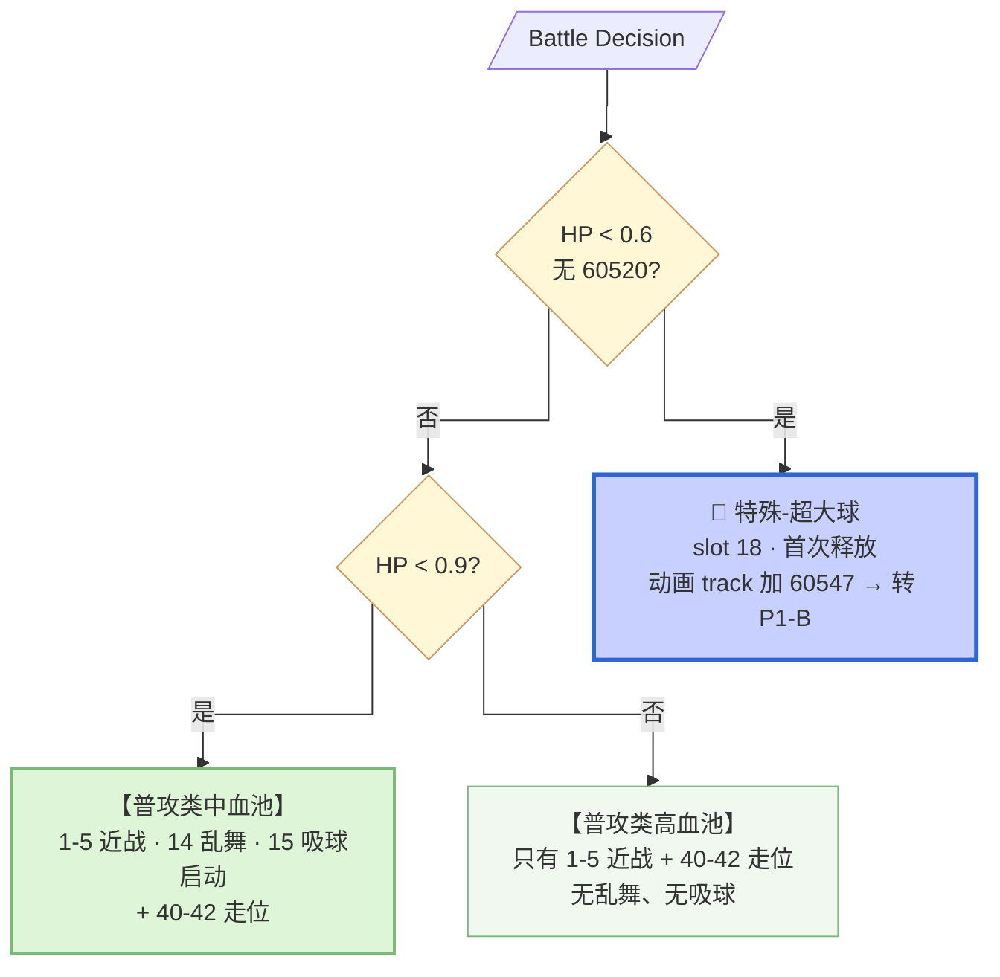
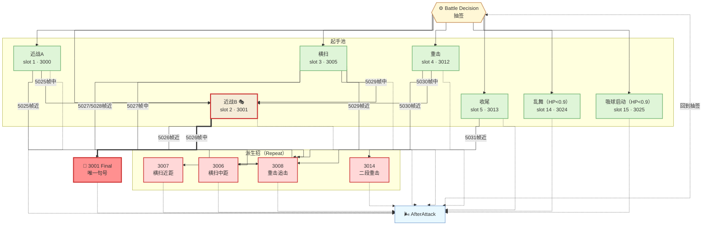
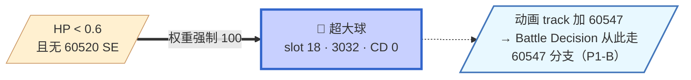

# Phase 1-A 全景图（v4 · 按 SetCoolTime 分类重构）

**触发条件**：无 60545/60546/60547 SE，非 60566（else 兜底分支）

**P1-A 内部还有 HP 分层**：

| 血量 | 分支 | 招式池 |
|------|------|--------|
| HP > 0.9 | 高血兜底 | 只有普攻 slot 1-5 + 走位 40-42 |
| **HP < 0.9** | 中血分支（line 726）| **普攻 + 乱舞 slot 14 + 吸球启动 slot 15** |
| HP < 0.6 | 过渡分支（line 722）| 强制推 slot 18（超大球）→ 首发触发进入 P1-B |

**P1-A → P1-B 转移**：HP < 0.6 时权重池强制 slot 18 → 打出超大球（Act18）→ 动画 track 加 60547 → 进入 P1-B。

---

## 分类标准

- **普攻类**：有 SetCoolTime，走权重抽签（策划管理的常规招）
- **特殊类**：无 CD 或 CD=0，SE 强制触发（P1-A 只有超大球，作为转阶段仪式）
- **走位类**：位移/转身，无伤害

---

## 全景图 · 顶层判定优先级（P1-A 简化版）

**关键观察**：**P1-A 是最简朴的形态**——只有一个特殊类招式（超大球），且它的存在纯粹是为了**转阶段**（首次释放后 boss 就进入 P1-B 不再回来）。P1-A 的常态战斗完全靠普攻类。

---

## 一、普攻类（自回环连通图）

### 招式清单

| Slot | 招式 | AttackID | CD | HP>0.9 | HP<0.9 | 派生 |
|------|------|----------|-----|--------|--------|------|
| 1 | 近战A | 3000 | 10s | ✓ | ✓ | 5025帧 |
| 2 | 近战B 🎭 | 3001 | 20s | ✓ | ✓ | 5026帧（含唯一 Final）|
| 3 | 横扫 | 3005/3010 | 20s | ✓ | ✓ | 5027/5028/5029帧 |
| 4 | 重攻击 | 3012 | 20s | ✓ | ✓ | 5030帧 |
| 5 | 近战收尾 | 3013 | 10s | ✓ | ✓ | 5031帧 |
| 14 | 乱舞 | 3024 | 30s | ❌ | **✓** | 无 |
| 15 | 吸球启动 | 3025 | 20s | ❌ | **✓** | 无（P1-A 不会走到 60566 分支）|

### 状态图（普攻循环 + 派生）

**注意 P1-A 与 P1-B 的差异**：**吸球启动 slot 15 在 P1-A 打完不会转特殊类**——因为 P1-A 分支的顶层没有 60566 判定（P1-A 是 else 兜底），所以 60566 上身也不会强制走 slot 16/17。**P1-A 的吸球是"孤立招式"**，只有起手没有释放段——**这可能就是玩家在 P1-A 阶段感觉"boss 吸球后不接下一段"的原因**（如果实测确实如此）。

---

## 二、特殊类 · 超大球（转阶段仪式）

**入口**：HP < 0.6 且无 60520 SE（line 722）
**特点**：`SetCoolTime(3032, 0)`——**冷却 0**
**首次身份**：**转阶段仪式**——播完动画 track 加 60547，从此 P1-A 关闭，进入 P1-B

**这是 P1-A 唯一的特殊类招式**。它的存在纯粹是为了转阶段——首次释放后 boss 从此在 P1-B 分支跑。

---

## 权重矩阵

**HP > 0.9 高血兜底**：

| 距离段 | 朝向 | 近战A (1) | 近战B (2) | 横扫 (3) | 重击 (4) | 收尾 (5) | 靠近 (40) | 侧步 (41) | 侧步 (42) |
|--------|------|-----|-----|-----|-----|-----|-----|-----|-----|
| >30 | 前方/背身 | 50 | 100 | 100 | 0 | 0 | 50 | - | - |
| >20 | 前方/背身 | 50 | 100 | 100 | 0 | 0 | 50 | - | - |
| >10 | 前方/背身 | 100 | 100 | 100 | 50 | 0 | 50 | - | - |
| >5 | 前方/背身 | 100 | 100 | 100 | 50 | 0 | 50 | 0 | 50 |
| ≤5 | 前方 | 50 | 50 | 100 | 50 | **200** | 0 | 50 | 0 |
| ≤5 | 背身 | 0 | 0 | 100 | 0 | 0 | 50 | 50 | 50 |

**HP < 0.9 中血**（增加乱舞和吸球）：结构与 P1-B 权重矩阵相同，见 `phase1B.md`。

---

## 全局抑制锁

| 身上 SE | 效果 |
|---------|------|
| 60590 | slot 1/2/3 = 0（普攻锁）|
| 60591 | slot 41/42 = 0（走位锁）|

---

## 关键设计洞察

1. **P1-A 是"教学阶段"**——招式池最简朴（HP>0.9 时只有 5 种普攻），Interrupt 只有 Repeat 类型（除了 3001 中距 Final），玩家在这里学会"boss 有派生 combo"这个基本机制
2. **HP<0.9 引入乱舞和吸球** = **提前透露 P1-B 的招式家族**——玩家在 P1-A 中血就能开始识别这两个招式的视觉特征，为 P1-B 做准备
3. **超大球的双重身份**（转阶段仪式 + 后续大招）用同一个 slot 18 承载——**玩家在 P1-A 只见过一次超大球**（首次释放），进入 P1-B 后才会重复见到
