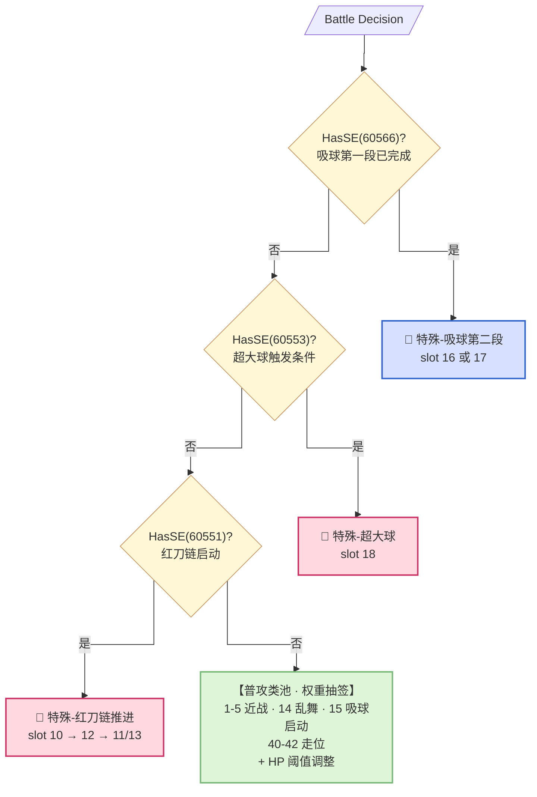
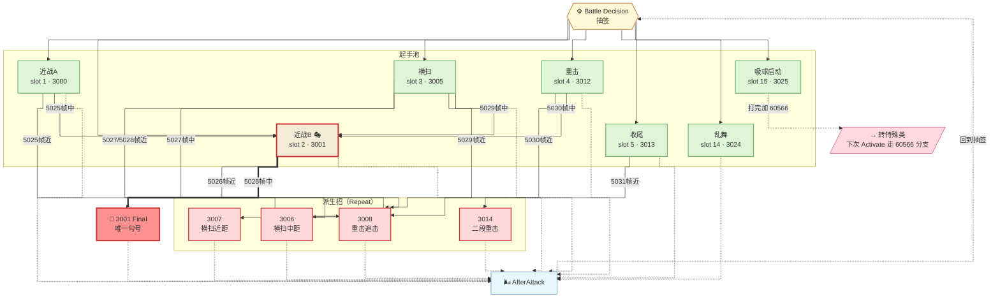
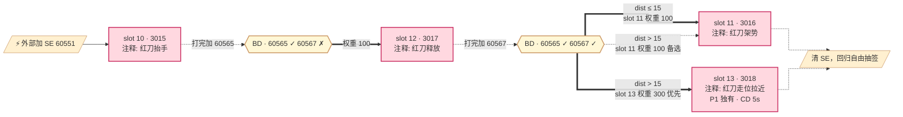
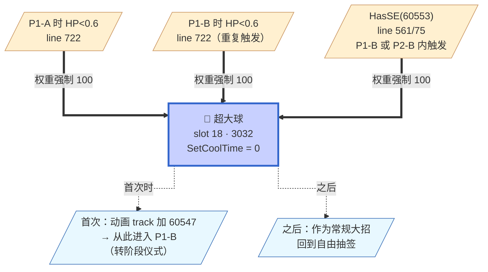
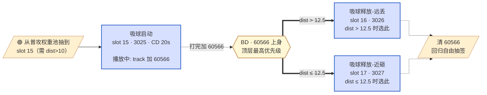
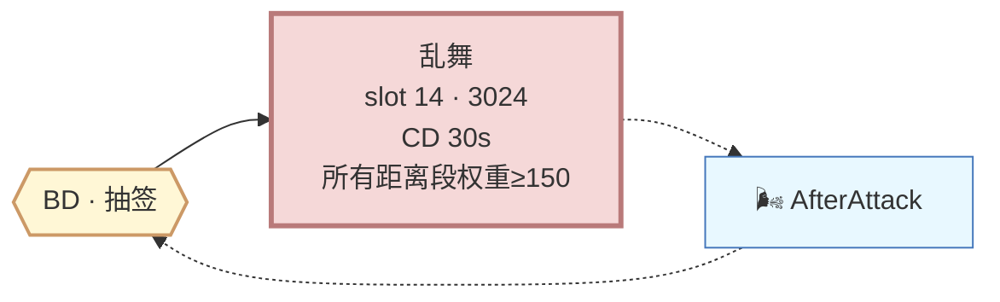

# Phase 1-B 全景图（v4 · 按 SetCoolTime 分类重构）

**触发条件**：`HasSE(60547)` — Act18 超大球首次释放后进入

**进入时机**：
- P1-A 内部 HP 分层：
  - HP > 0.9 → 只有普攻和走位
  - HP < 0.9 → 加入乱舞 slot 14 和吸球 slot 15
  - HP < 0.6 → 强制推 slot 18（超大球）→ 首发时加 60547 → 进入 P1-B
- **60% 是硬阈值**（`< 0.6`）

---

## 分类标准

**普攻类（有 SetCoolTime，走权重抽签）** — 策划管理的常规招式
**特殊类（无 CD 或 CD=0）** — SE 强制触发，不走权重池的招式
**走位类** — 位移/转身，不造成伤害

---

## 全景图 · 顶层判定优先级（分类树）



**顶层机制**：**特殊类的优先级永远高于普攻类**——boss 一旦身上有 combo SE，权重池被无视。玩家看到红刀抬手就知道"接下来必然按 combo 走完"，无法用距离引诱 boss 换招。

---

## 一、普攻类（自回环连通图）

普攻类的核心是"抽签 → 起手 → Interrupt 派生 → AfterAttack → 回到抽签"的循环。同时**有些招式起手后会通过 SE 转成特殊类**（例如吸球启动加 60566 → 下次 Activate 走特殊分支）。

### 招式清单

| Slot | 招式 | AttackID | CD | 派生行为 |
|------|------|----------|-----|---------|
| 1 | 近战A | 3000 | 10s | 5025 帧派生 |
| 2 | 近战B | 3001 | 20s | 5026 帧派生（含唯一 Final）|
| 3 | 横扫 | 3005/3010 | 20s | 5027/5028/5029 帧派生 |
| 4 | 重攻击 | 3012 | 20s | 5030 帧派生 |
| 5 | 近战收尾 | 3013 | 10s | 5031 帧派生 |
| 14 | 乱舞 | 3024 | 30s | 无派生 |
| 15 | 吸球启动 | 3025 | 20s | **打完加 60566 → 转特殊类**|

### 状态图（普攻循环 + 派生）



**关键观察**：
- **AfterAttack 回到 HUB 形成完整循环**——这就是"自回环连通图"
- **吸球启动 (slot 15) 是一条"逃逸边"**：打完不回 HUB，而是通过 SE 60566 跳转到特殊类
- **两栖招 3001（近战B）**：既能起手也能被派生（近战A 5025帧中距、横扫 5029帧中距、重击 5030帧中距都会派生成 3001）——**图上表现为"派生边指回起手池"**
- **只有一处 Final**：3001 的 5026帧中距——玩家学习的锚点

---

## 二、特殊类 · 红刀链

**入口**：外部加 SE 60551（授予时机在 lua 内没找到，可能由动画 track 或引擎事件触发）
**特点**：**无 SetCoolTime**（除 slot 13 追击有 CD 5s），完全不受冷却限制
**推进**：SE 60565/60567 作为进度位

### 严格代码分支

```
elseif HasSE(60551):
    if HasSE(60565):
        if HasSE(60567):
            if dist > 15:
                slot 11 = 100  slot 13 = 300 (远距高权重追击)
            else:
                slot 11 = 100
        else:
            slot 12 = 100
    else:
        slot 10 = 100
```

⚠️ **语义待你实测校准**：注释里 slot 10=抬手 / slot 11=架势 / slot 12=释放 / slot 13=追击拉近，但代码流程是 **slot 10 → slot 12 → slot 11/13**，与"抬手→架势→释放"直觉不完全对应。图按代码严格逻辑画：



---

## 三、特殊类 · 超大球

**入口**：3 种触发路径，都跟 HP 阈值或 60553 相关
**特点**：`SetCoolTime(3032, 0)`——**冷却 0**，靠触发条件本身限流
**双重身份**：首次释放是转阶段仪式（加 60547），之后作为常规大招



---

## 四、普攻类中的"短 combo" · 吸球

**吸球是普攻类**（slot 15 有 CD 20s），但它有一段短 combo 通过 SE 60566 强制推进。这段 combo 起手在普攻权重池，但推进阶段短暂进入"顶层判定优先级"分支。



**为什么归普攻类**：**slot 15 有 CD 20s**——boss 不能连续吸球，需要冷却。这是策划管理的普攻技能，只是它有短 combo 而已。**超大球 slot 18 的 CD 0** 才是真正的"特殊技能"标记。

---

## 五、普攻类 · 独立大招 乱舞



**乱舞是普攻类**（有 CD 30s），无 combo 无 Interrupt 派生，纯"抽签→播→呼吸"独立循环。冷却 30s + 距离段权重 150 = 平均每场战斗 3-5 次。

---

## 权重矩阵（普攻类）

| 距离段 | 朝向 | 近战A<br>(1) | 近战B<br>(2) | 横扫<br>(3) | 重击<br>(4) | 收尾<br>(5) | 乱舞<br>(14) | 吸球启动<br>(15) | 走位<br>(40-42) |
|--------|------|-----|-----|-----|-----|-----|-----|-----|-----|
| >30 | 前方/背身 | 50 | 100 | 100 | 0 | 0 | 150 | 0 | 50 |
| >20 | 前方/背身 | 50 | 100 | 100 | 0 | 0 | 150 | **200** | 50 |
| >10 | 前方/背身 | 100 | 100 | 100 | 50 | 0 | 150 | **200** | 50 |
| >5 | 前方/背身 | 100 | 100 | 100 | 50 | 0 | 150 | **200** | 50/50 |
| ≤5 | 前方 | 50 | 50 | 100 | 50 | 200 | 150 | **200** | 0/50/0 |
| ≤5 | 背身 | 50 | 50 | 100 | 50 | 200 | 150 | **200** | 0/50/0 |

**观察**：
- **slot 15（吸球启动）dist>20 起权重 200**——远距 boss 强烈倾向吸球
- **slot 14（乱舞）全距离段权重 150**——是 P1-B 的"节奏骨架"
- **只有 dist>30 时 slot 15 = 0**——太远吸球没意义

---

## 全局抑制锁

| 身上 SE | 效果 |
|---------|------|
| 60590 | slot 1/2/3 = 0（普攻锁）|
| 60591 | slot 41/42 = 0（走位锁）|
| 60593 | slot 15 = 0（吸球锁）|

---

## 关键设计洞察

1. **SetCoolTime 有无 = 招式属性的官方分类标记**
   - 有 CD → 策划管理的常规招（普攻类）
   - CD=0 或无 → 特殊触发招（红刀链、超大球）
   - 你之前看到 line 987 的 `SetCoolTime(3032, 0)` 觉得是死代码，其实是**显式声明"这不是靠 CD 限流的常规招"**

2. **红刀链的"无 CD"是设计意图**
   - 红刀链每次触发是**外部事件**（可能是 HP 到某阈值、或某招后自动触发）
   - 触发条件本身就限流，不需要 CD 再限一次

3. **吸球和超大球的 slot 18 复用**
   - `SetCoolTime(3032, 0)` = 超大球（特殊招）
   - `SetCoolTime(3025, 20)` = 吸球（普攻招）
   - **同一个 slot 承载两种性质的招**——这是 FS 的编码技巧
