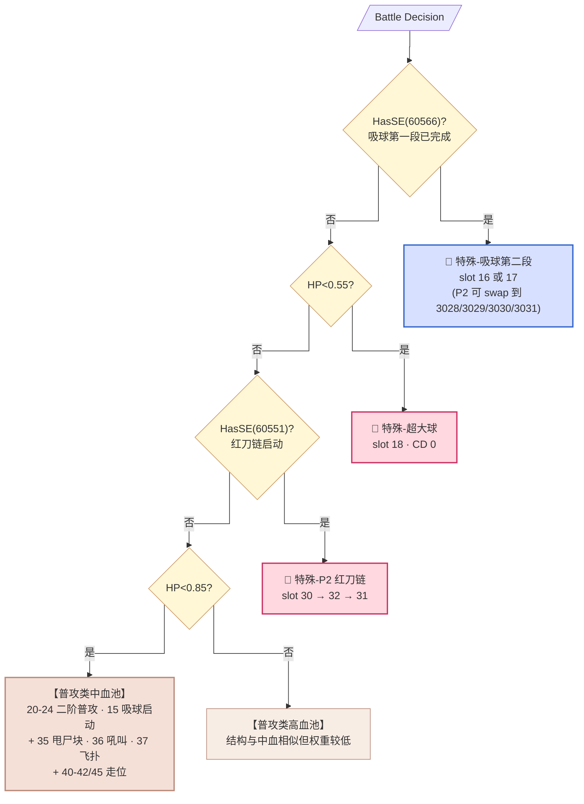
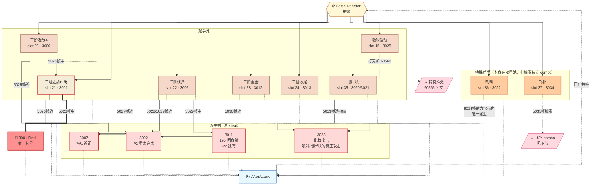
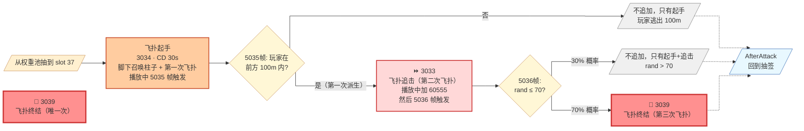
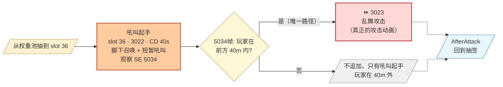
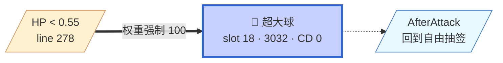

# Phase 2-A 全景图（v4 · 按 SetCoolTime 分类重构）

**触发条件**：`HasSE(60546)` — P1-B HP=0 死亡演出后由外部注入（DragonForm 变身）

**招式家族替换**：
- 普攻升级为 slot 20-24（动画换 A001 组）
- 红刀链缩短为 3 段 slot 30-32（无 slot 13 追击）
- **新增**：飞扑 slot 37、甩尸块 slot 35/45、吼叫→乱舞 slot 36
- **继承**：吸球链跨阶段共用 slot 15-18

---

## 分类标准（同 P1-B）

- **普攻类**：有 SetCoolTime，走权重抽签
- **特殊类**：无 CD 或 CD=0，SE 强制触发
- **走位类**：位移/转身

---

## 全景图 · 顶层判定优先级



---

## 一、普攻类（自回环连通图）

### 招式清单

| Slot | 招式 | AttackID | CD | 派生行为 |
|------|------|----------|-----|---------|
| 20 | 二阶近战A | 3000 (A001) | 10s | 5025帧派生 |
| 21 | 二阶近战B 🎭 | 3001 (A001) | 20s | 5026帧派生（含 Final）|
| 22 | 二阶横扫 | 3005/3010 | 20s | 5027/5028/5029帧 |
| 23 | 二阶重击 | 3012 | 20s | 5030帧派生 |
| 24 | 二阶收尾 | 3013 | 10s | 无派生 |
| 15 | 吸球启动 | 3025 | 20s | 打完加 60566 → 转特殊类 |
| 35 | 甩尸块 | 3020/3021 | 20s | 5033帧派生 |
| 36 | 吼叫 | 3022 | 40s | 5034帧派生（唯一路径 → 3023 乱舞）|
| 37 | 飞扑 | 3034 | 30s | 5035/5036帧派生（复杂 combo）|
| 45 | StepSafety | (走位) | 20s | 无派生 |

### 状态图



**注意**：**吼叫 (slot 36) 和飞扑 (slot 37) 都是普攻类**（有 CD），但它们的派生 combo 独立成图（下面几节）。

---

## 二、飞扑家族 combo（普攻类内部长 combo）

**你说的正确路径**：脚下召唤柱子 + 一次飞扑（3034 起手）→ 有概率追加 1 次或 2 次

**代码严格逻辑**：

```
Act37 (3034) 播放:
  5035 帧触发:
    如果 无 60555 (第一次):
      前方100m内 → append Repeat 3033 (飞扑追击)
    如果 有 60555:
      前方100m + rand≤70 → append Final 3039 (飞扑终结)
      前方100m + rand>70 → return true (不接)

3033 (飞扑追击) 播放中会加 60555:
  5036 帧触发:
    (P2-B 分支：60545 上身，暂不看)
    P2-A: 前方100m + rand≤70 → append Final 3039 (飞扑终结)
```



**三种可能路径**：
- **1 段**：只有起手 3034（玩家逃出 100m）
- **2 段**：起手 3034 → 飞扑追击 3033（30% 概率不追加终结）
- **3 段**：起手 3034 → 飞扑追击 3033 → **飞扑终结 3039**（70% 概率）

**注意**：代码中 5035 帧还有一条 `有 60555 → Final 3039`，但这条路径需要飞扑起手时 60555 已经上身——正常战斗中飞扑起手时 60555 应该是未上身的（60555 是第二次飞扑派生 3033 才加的），所以这条路径**日常观察不到**，可能是给某些特殊情境（如玩家 stun 后状态未清）准备的兜底。

---

## 三、吼叫→乱舞（普攻类内部短 combo）

**你的观察**：吼叫（3022）本身只是起手动画，真正的攻击是派生的 3023



**关键**：
- **5034 帧只有一条派生路径 3023，无概率门限**——只要玩家在 40m 前方内，必接乱舞
- **不会派生成普攻或其他招**——你的记忆是对的
- **不会派生成 P2-B 的转阶段仪式（Act38 长吼叫）**——Interrupt 里没有 5034 → 3038 的路径
- **CD 40s** 意味着乱舞是"一场战斗最多打几次"的稀有招

---

## 四、特殊类 · P2 红刀链（3 段版）

**入口**：外部加 SE 60551
**特点**：**无 SetCoolTime**（除 slot 13 P1 独有的追击）
**分支结构**：与 P1-B 相同，但**无追击段**（P2 boss 移动更快，不需要 slot 13）


⚠️ **红刀链动作语义与 P1 相同待你实测校准**——参见 `phase1B.md` 说明。

---

## 五、特殊类 · 超大球（大招化）

在 P2-A **不再是转阶段仪式**（那次仪式在 P1-B → P2-A 过渡时已完成），此处是**常规大招**：



---

## 六、普攻类中的短 combo · 吸球（跨阶段共用）

**结构与 P1-B 完全相同**（slot 15 → 60566 → slot 16/17）。

**P2 特有**：Act16/17 内部根据 SE 5401/60576/60577 会 swap AttackID：

| 条件 | slot 16 | slot 17 |
|------|---------|---------|
| 无特殊 SE | 3026 | 3027 |
| **HasSE(60576)** | **3028** | **3029** |
| **HasSE(60577)** | **3030** | **3031** |
| 5401 + HP≤0.4 | 3028 | 3029 |
| 5401 + HP≤0.2 | 3030 | 3031 |

**这是"槽位不变，AttackID 内部 swap"的 FS 手法**——玩家看到吸球释放但每次视觉稍有不同，其实是同一个 slot 走不同分支。

---

## 权重矩阵（P2-A 中血 HP<0.85）

| 距离段 | 朝向 | 二阶近战A<br>(20) | 二阶近战B<br>(21) | 二阶横扫<br>(22) | 二阶重击<br>(23) | 二阶收尾<br>(24) | 甩尸块<br>(35) | 吼叫→乱舞<br>(36) | 飞扑<br>(37) | 走位 |
|--------|------|-----|-----|-----|-----|-----|-----|-----|-----|------|
| >30 | 前方 | 50 | 100 | 100 | 0 | 0 | 0 | 0 | 0 | 40:50 |
| >30 | 背身 | 0 | 0 | 0 | 0 | 0 | 0 | 0 | 0 | 40/45:100 |
| >20 | 前方 | 50 | 100 | 100 | 0 | 0 | 0 | **200** | **200** | 50 |
| >20 | 背身 | 0 | 0 | 0 | 0 | 0 | 0 | 0 | 0 | 40/45:100 |
| >10 | 前方 | 100 | 50 | 50 | 50 | 0 | 100 | **200** | **200** | 50 |
| >10 | 背身 | 0 | 0 | 50 | 0 | 0 | 100 | 0 | 0 | 40/45:100 |
| >5 | 前方 | 50 | 50 | 50 | 100 | 100 | 100 | **200** | 0 | 40:50, 41:50, 42:75 |
| >5 | 背身 | 0 | 0 | 50 | 0 | 0 | 100 | 0 | 0 | 40/45:100 |
| ≤5 | 前方 | 25 | 0 | 50 | 100 | **200** | 100 | **200** | 0 | 41:75, 42:50 |
| ≤5 | 背身 | 0 | 50 | 100 | 0 | 0 | **200** | 0 | 0 | 45:200 |

**观察**：
- **中距 (>20/>10) 前方**：吼叫和飞扑都拉到 200——**中距是 P2-A 最危险的距离**
- **贴脸背身**：甩尸块和 slot 45 都拉到 200——绕背时 boss 会强制侧步 + 甩尸块清场
- **贴脸前方**：二阶收尾权重 200 + 吼叫权重 200——快速结束贴脸的两把刀

---

## 关键设计洞察

1. **P2-A 的主要变化不在"新招式"，而在"combo 结构升级"**
   - 飞扑家族有最长的 combo（3 段可选）
   - 吼叫→乱舞把"吼叫"这个心理预警和"乱舞"实体攻击拆开
   - 派生招引入 3011（180°回身斩）反制绕背玩家

2. **飞扑家族的 3 段设计是 P2-A 的教学重点**
   - 玩家在挑战失败中学会："看到脚下柱 = 至少要翻两次"
   - 追加机制的概率（第二次必接、第三次 70%）让玩家永远不能完全预判

3. **吼叫 (slot 36) 是 P2-A 唯一"无概率的必接派生"**
   - 5034 帧只要玩家在前方 40m 内，100% append 3023
   - CD 40s 保证不会滥用
   - **这是 P2-A 最"稳定"的招——玩家一旦学会读吼叫起手，就能可靠预判**

4. **P2 特有 slot 45（StepSafety）的作用**
   - 贴脸背身时权重 200，是 P2-A 独有的"绕背反制"
   - 与 P1 的 slot 41/42 相比，45 会主动往玩家侧后方闪，把玩家甩到背后
