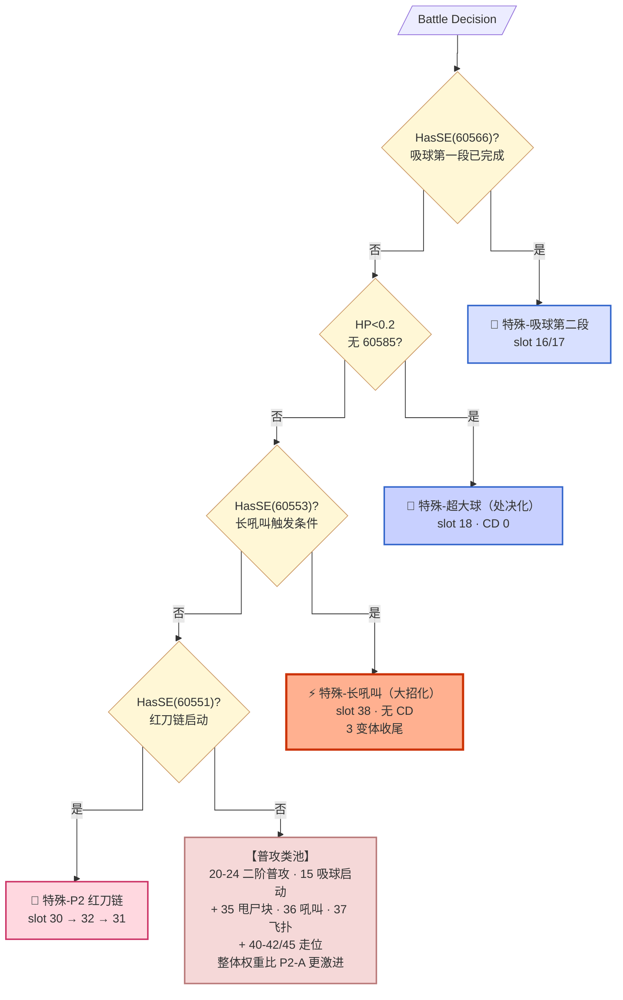
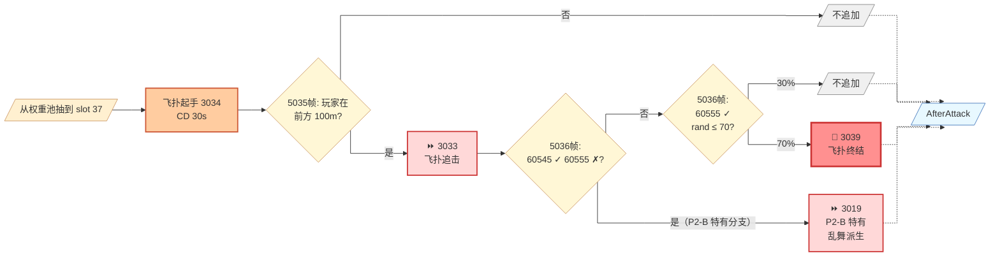
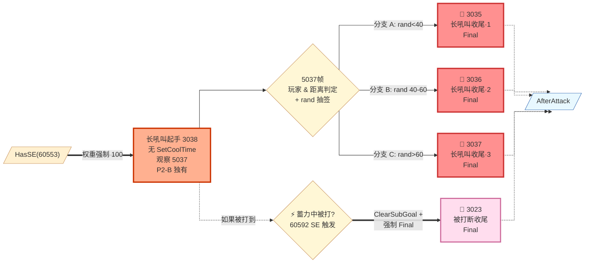
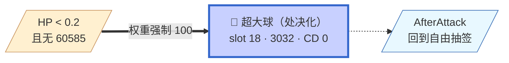

# Phase 2-B 全景图（v4 · 按 SetCoolTime 分类重构）

**触发条件**：`HasSE(60545)` — Act38 长吼叫首次释放后进入
**招式家族**：P2-A 全部 + 长吼叫大招化 + HP<0.2 处决

---

## 分类标准

- **普攻类**：有 SetCoolTime，走权重抽签（同 P2-A）
- **特殊类**：无 CD 或 CD=0，SE 强制触发
- **走位类**：位移/转身

---

## 全景图 · 顶层判定优先级

**观察 P2-B 相比 P2-A 的顶层变化**：
- **新增最高优先级 Q2 处决判定**（HP<0.2）——boss 濒死时自动进入处决模式
- **新增 Q3 长吼叫大招判定**——60553 变成通往 slot 38（P2-B）或 slot 18（P1-B）的双分支入口
- **HP 阈值判定被 SE 强制覆盖**——P2-A 的血量分层在 P2-B 里退化，因为 P2-B 本身就是"低血阶段"的标志

---

## 一、普攻类

**结构与 P2-A 相同**（招式池、派生规则、状态图完全一致），详见 `phase2A.md`。

**P2-B 相比 P2-A 的差异**：
- **权重整体上调**（贴脸横扫从 50→100 等）
- Interrupt 5036 帧多了一条 3019（乱舞派生）路径 —— 只在 60545 上身且 60555 不在时触发

---

## 二、飞扑家族 combo（含 P2-B 特有分支）

**P2-A 有的 3 段路径全部继承**，加上 **P2-B 特有的 5036 帧 3019 派生**：

**P2-B 独有**：如果第二次飞扑后 60555 未上身（可能是打断/干扰导致的边缘情况），会走到 `60545 无 60555` 分支派生成 3019 而非 3039。

---

## 三、吼叫→乱舞

**结构与 P2-A 完全相同**（`phase2A.md` 的第三节）。

---

## 四、特殊类 · 长吼叫（P2-B 专属大招）

**入口**：`HasSE(60553)`
**特点**：**代码里根本没有 SetCoolTime 3038**——真正的"无 CD"特殊招
**独特设计**：**5037 帧派生 3 变体收尾**（3035/3036/3037，rand 抽签）

### 完整 combo 图

**为什么 3 变体收尾这么设计**：
- **一段起手动画（3038）+ 三段收尾动画（3035/3036/3037）** = 玩家看到"每次长吼叫都不一样"
- **只需要 3 段动画，就能给玩家"变化多端"的感受**——用少量素材制造大量差异
- **rand 抽签让玩家无法记招**——"这次是哪个收尾"永远不确定

**60592 蓄力打断**：boss 长吼叫或飞扑蓄力时被打到 → 强制清空 SubGoal → 硬性接 3023 (Final) 收尾。**这是玩家主动打断 boss 大招的正确应对方式**。

---

## 五、特殊类 · 超大球（处决化）

**入口**：`HP < 0.2 且无 60585 SE`
**变化**：从 P1-B 时的"HP<0.6 触发"变为 **"HP<0.2 触发"**——boss 濒死时的最后手段

**60585 是 SE 抑制锁**——防止 boss 频繁重复超大球（打完一次会短时间上锁）。

---

## 六、其他特殊类（继承）

- **P2 红刀链**：结构与 P2-A 相同（3 段版），见 `phase2A.md`
- **吸球短 combo**：结构与 P2-A 相同，见 `phase2A.md`

---

## 权重矩阵（P2-B 激烈版差异）

结构与 P2-A 相同，主要差异：

| 距离段 | 二阶收尾 (24) 贴脸 | 二阶横扫 (22) | 吼叫→乱舞 (36) | StepSafety (45) |
|--------|-------|-------|-------|-------|
| P2-A ≤5 前方 | 200 | 50 | 200 | - |
| **P2-B ≤5 前方** | **200** | **100** | **200** | - |
| P2-A ≤5 背身 | 0 | 100 | 0 | 200 |
| **P2-B ≤5 背身** | **0** | **100** | **0** | **200** |

**权重变化不大是有原因的**：P2-B 的"激烈感"不来自权重上调，而来自**新增的两个大招入口（长吼叫 slot 38、处决超大球 slot 18）**——这两个不是从权重池抽的，是 SE 强制的。**P2-B 感觉更凶不是因为普攻更快，而是大招频率更高**。

---

## 关键设计洞察

1. **P2-B 是"大招权限扩展"阶段**
   - slot 38 长吼叫和 slot 18 超大球都从"仪式招"变成"常规大招"
   - 玩家进入 P2-B 后每场战斗会多经历 2-3 次这两个招式

2. **长吼叫的 3 变体收尾是 FS 的"少素材大差异"技巧**
   - 一个起手动画 (3038) + 三个收尾动画 (3035/3036/3037) = 玩家感受到 3 种不同的招
   - 总动画量只增加 3 段，但组合出的"独特感"翻 3 倍

3. **HP<0.2 处决 slot 18 的存在** = FS 强制濒死 boss 有一个"最后的爆发"
   - 玩家不能靠"磨血"取胜，必须准备好应对最后阶段的密集大招
   - 60585 抑制锁保证不会连续处决

4. **60592 打断收尾 3023 是玩家的主动手段**
   - 多数 boss 招式的 combo 是 boss 主导，只有这个"打断蓄力"是玩家主导 boss 的行为
   - 学会主动打断 = 学会控制 P2-B 节奏

5. **Interrupt 表 P2-A/P2-B 完全共用**（同一个 60545/60546 分支）
   - **"是否 P2-B" 完全靠权重池的额外招式区分**，Interrupt 不管你是激烈版还是普通版
   - 大大减少了策划的调参工作量
